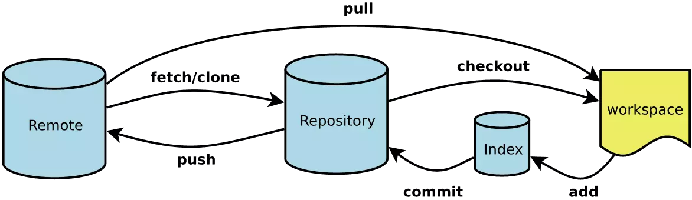
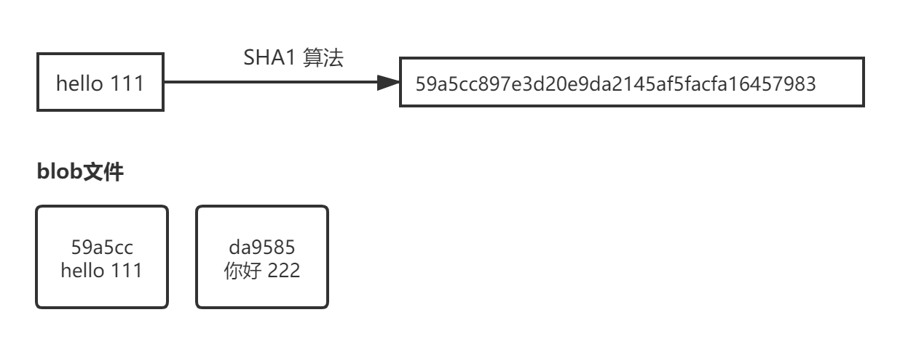
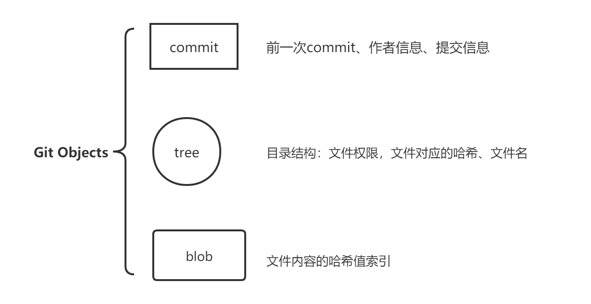
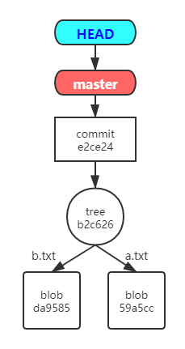
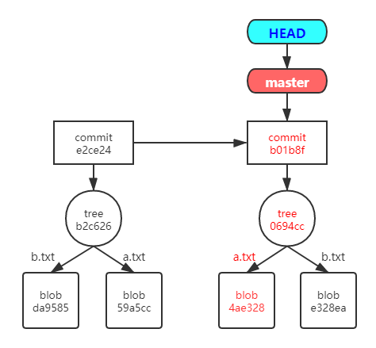
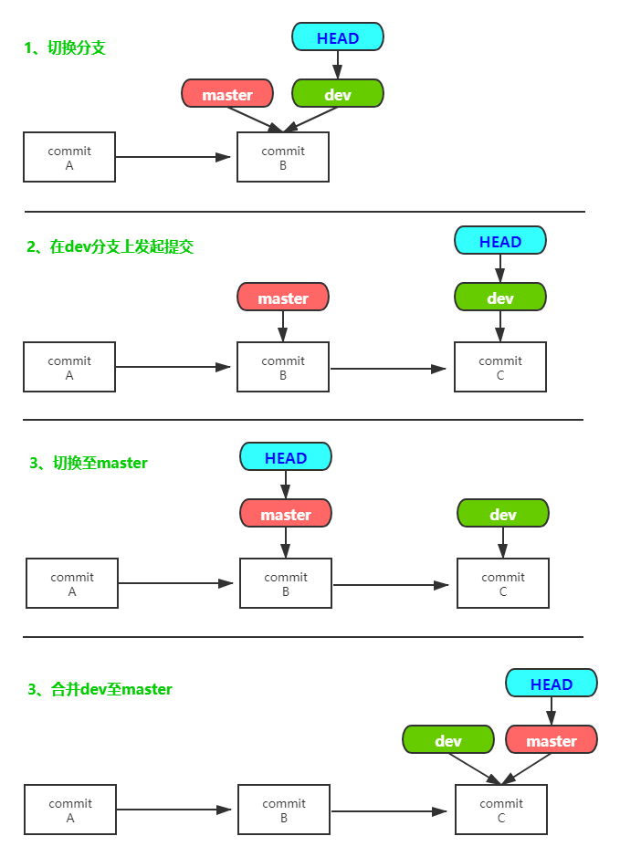

# Git基本原理
## 前言
>在日常工作中，开发者必不可少的需要运用git进行版本管理。本文主要通过梳理git流程来介绍git的基本原理。

### Git是什么？
Git 是目前世界上最优秀的分布式版本控制系统。
### 版本控制系统是什么？
- 版本控制（Revision control）简单说就是用于管理多人协同开发项目的技术。
- 版本控制系统常见类别有两种：
    - 集中式版本控制系统，如SVN
        >所有的版本数据都保存在服务器上，协同开发者从服务器上同步更新或上传自己的修改。用户的本地只有自己以前所同步的版本，不连网时，用户看不到历史版本，也无法切换版本验证问题，或在不同分支工作。同时，所有数据保存在单一服务器上，若服务器损坏，会丢失所有的数据。
    - 分布式版本控制系统，如Git
       >分布式版本控制系统是分布式的，当你从中央服务器拷贝下来代码时，你拷贝的是一个完整的版本库，包括历史纪录，提交记录等，这样即使某一台机器宕机也能找到文件的完整备份。

## Git流程梳理


>上图囊括了Git的基础流程，但在梳理这个流程前，我们先来熟悉下几个专有名词与文件状态。

------

### 四个专有名词

+ #### Workspace：工作区
    + 就是平时存放项目代码的地方。
    + 对文件进行新增，更改，删除此类操作发生在工作区里。

+ #### Index / Stage：暂存区
    + 临时存放对项目的改动。不保存文件实体，保存即将提交的文件列表信息，通过id指向每个文件实体。
    + 可以使用`git status`查看暂存区的状态。   <br />
    *注：存放在工作区隐藏文件夹.git下的index文件（.git/index）中。*

+ #### Repository：仓库区（或版本库）
    + 版本库中保存了被提交过的各个版本的数据。
    + 版本库里除了包含刚刚提及的暂存区，还有Git为我们自动创建的第一个分支master，以及指向master的一个叫HEAD的指针。HEAD永远指向最新放入仓库的版本。   <br />
    *注：位于工作区的隐藏文件夹 .git。*

+ #### Remote：远程仓库
    + 托管代码的服务器。
    + 远程仓库的内容可能被分布在多个地点的处于协作关系的本地仓库修改，因此它可能与本地仓库同步，也可能不同步。

### 四种文件状态

+ #### Untracked: 未跟踪
    + 文件存在项目文件夹中，但并未加入到git版本库，不参与版本控制。
    + 通过`git add [filename]` 可将文件状态修改为`Staged`状态。
+ #### Unmodify: 未修改 （文件已入库）
    + 文件已入版本库，未修改。即版本库中的文件快照内容与文件夹中完全一致。
    + 若此时对文件进行了修改，状态变更为`Modified`。   <br /> 
    + 使用`git rm [filename]`命令，文件移出版本库， 文件状态更改为`Untracked`。
- #### Modified: 已修改
    + 文件在工作区已修改。
    + 通过`git add [filename]`可将文件状态修改为`Staged`状态；    <br /> 
      通过`git checkout [filename]`丢弃对文件的改动, 返回到`unmodify`状态。    <br /> 
      *注：`git checkout [filename]` 即从版本库中取出文件, 覆盖当前修改。*
- #### Staged: 暂存状态
    + 通过`git commit [filename]`可将对文件的修改同步到版本库中，此时版本库中的文件快照内容又与文件夹中变为一致。文件状态变更为`Unmodify`。
    + 通过`git reset HEAD [filename]`取消暂存，文件状态变更为`Modified`。    <br /> 
      *注：`git reset HEAD [filename]`即将文件回滚到最近一次`commit`提交的状态。


------

### 流程分析

> 在了解上面几个专有名与文件状态后，我们再来看这张图。从左至右，为一般工作前的准备工作；从右至左为对文件进行操作后的提交保存等操操。


#### 从左至右
1. 从远端获取更新到本地
    - 本地仓库中不存在，从远端仓库克隆`git clone`一个版本库。
    - 本地仓库中已存在，获取`git fetch`远程仓库Remote所有更新，但不自动合并当前分支。
2. 更新内容至工作区
    - 变更或新建`git checkout`分支，工作区对应版本库中最新内容。
    - 合并分支`git merge`，工作区对应版本库中最新内容。
3. 取回远程主机某个分支的更新，再与本地的指定分支合并
    - *注：`git pull` 近似于 `git fetch + git merge`*

#### 从右至左
1. 对工作区中1已纳入版本控制的文件进行了新增，删除，修改操作，文件状态更新为：`Modified`。
    *注：配置`.gitignore`文件，将部分文件不加入git版本库的管理；此类文件的状态为：`Untracked`。
2. 对上述文件执行`git add`命令，将文件状态更改为`Staged`，并将改动添加到暂存区。
3. 对暂存区的文件执行`git commit`命令，提交改动至版本库。
    *注：此时当前版本库中的文件快照，与工作区文件夹中内容一致*
4. 对最新一次提交执行`git push`命令，将改动推送至远端仓库。

#### 小结
日常工作中，我们使用Git的基本流程及如上所示。主要是根据实际开发情况来切换文件的状态，并将改动在Git系统的几个分区中传递。那Git又是如何保存每次改动的呢，又是如何将改动更新至工作区的呢。

------

## Git原理梳理

### 简介
首先我们看下官网是如何介绍Git的：
> Git 更像是把数据看作是对小型文件系统的一组快照。 每次你提交更新，或在 Git 中保存项目状态时，它主要对当时的全部文件制作一个快照并保存这个快照的索引。 为了高效，如果文件没有修改，Git 不再重新存储该文件，而是只保留一个链接指向之前存储的文件。 Git 对待数据更像是一个 **快照流**。

难顶.....我们还是通过实例来逐步分析~

### 实例

#### 新建项目
+ 执行`git init` 命令后，会在项目文件目录中，新增一个.git目录，里面保存了git的所有信息。
```yaml
# 在当前目录新建一个Git代码库(在工作区新建Git仓库)
$ git init
# 工作区新建两个文件
$ echo 'hello 111' > a.txt
$ echo '你好 222' > b.txt
# 将工作区的两个文件更新到Git版本库中（文件状态：Untracked --> Staged)
$ git add *.txt
```
+ .git目录下有几个重要的文件/文件夹
```yaml
$ tree .git
├─hooks 
├─info # config文件：主要存储项目的一些配置信息
├─objects # 存储git对象
│  ├─info
│  └─pack
└─refs
│   ├─heads # 包含所有本地分支；每个分支都为文件，存储该分支当前指向的commit。
│   ├─remotes # 远程仓库信息
│   │  └─origin # origin/HEAD：指向远程仓库当前分支。
│   └─tags # 记录版本信息
├─config # config文件：主要存储项目的一些配置信息
├─HEAD # 记录当前的头指针，指向当前分支；HEAD指向分支，分支指向commit，commit为一个二进制文件
├─index # 一个二进制文件存储暂存区的信息
```

#### 提交改动
+ 执行`git add .`命令后，`.git/objects` 目录下新增两个文件
```yaml
$ tree .git/objects
├─80
│  └─da958505908e9f2f374422f4ca99f7d01754fd
├─d1
│  └─59a5cc897e3d20e9da2145af5facfa16457983
├─info
└─pack
# 查看文件类型(git cat-file -t)
$ git cat-file -t d159
blob
$ git cat-file -t 80da
blob
# 查看文件内容(git cat-file -p)
$ git cat-file -p d159
hello 111
$ git cat-file -p 80da
你好 222
# 得到两个blob类型的文件，储存工作区对应文件的内容
```
+ **blob object** 储存文件具体内容      <br />
git通过SHA1算法，生成blob object的Key；git是通过键值对的形式进行数据存储的。


+ 执行`git commit .`命令后，`.git/objects` 目录下又新增两个文件
```yaml
$ git commit -m '新增文件a,b'
# .git/objects新增了两个文件
$ tree .git/objects
├─80
├─b2
│  └─c6267f1f54fb56c6379139a62b63d17b326e36
├─d1
├─e2
│  └─ce24409c3a0540ac38f56b1cebb449104040d7
├─info
└─pack
```

```yaml
# 分别查看文件的类型与内容
# 一个 tree 类型的git对象
# 保存了一个目录结构，包含，文件权限，类型，文件哈希索引值，文件名
$ git cat-file -t b2c626
tree
$ git cat-file -p b2c626
100644 blob d159a5cc897e3d20e9da2145af5facfa16457983    a.txt
100644 blob 80da958505908e9f2f374422f4ca99f7d01754fd    b.txt
```

```yaml
# 一个 commit 类型的git对象
# 保存了一个tree对象的哈希值，作者，提交信息等
$ git cat-file -t e2ce24
commit
$ git cat-file -p e2ce24
tree b2c6267f1f54fb56c6379139a62b63d17b326e36
author 砰砰枪 <41907851+pkxsjj@users.noreply.github.com> 1584238372 +0800
committer 砰砰枪 <41907851+pkxsjj@users.noreply.github.com> 1584238372 +0800
'新增文件a,b'
```
+ blob、tree、commit三种git对象


+ 查看HEAD与refs文件夹     <br/>
HEAD：指向当前分支，指向 `master`     <br/>
.git/refs/heads/master 指向最新一次提交 `0694cc453f67008966a1f53db236a86130bd4343`

+ HEAD，分支，git对象之间的关系     <br/>


#### 版本更新
+ 修改文件内容并提交
```yaml
$ echo 'nice 333'>a.txt
$ git add .
$ git commit -m '修改文件a.txt'
# 查看.git/objects下新增的git对象
```

```yaml
# 一个新的tree对象
$ git cat-file -t 0694cc
tree
$ git cat-file -p 0694cc
100644 blob 4ae328eab44ba65393686576a0d0da242c90d640    a.txt # 一个新的blob对象
100644 blob 80da958505908e9f2f374422f4ca99f7d01754fd    b.txt
```

```yaml
# 一个新的commit对象
$ git cat-file -t 34e821
commit
$ git cat-file -p 34e821
tree 0694cc453f67008966a1f53db236a86130bd4343
parent e2ce24409c3a0540ac38f56b1cebb449104040d7 # 前一个commit对象
author 砰砰枪 <41907851+pkxsjj@users.noreply.github.com> 1584240567 +0800
committer 砰砰枪 <41907851+pkxsjj@users.noreply.github.com> 1584240567 +0800
```
+ 查看HEAD与refs文件夹的变化
HEAD无变化：指向 `master`     <br/>
.git/refs/heads/master变化，指向最新一次提交 `34e821e4ce68faca42112be1b892708aae3e199e`
+ 

#### 分支原理
+ 新建并切换分支，查看HEAD与refs
```yaml
$ git branch dev
$ git checkout dev
Switched to branch 'dev'
```
HEAD变化：指向 `dev`     <br/>
.git/refs/heads 新增 dev 文件夹     <br/>
.git/refs/heads/dev 与 .git/refs/heads/master' 均指向 最新一次提交 `34e821e4ce68faca42112be1b892708aae3e199e`

+ 改动文件与提交，查看提交记录，查看HEAD与refs
```yaml
$ echo '再见 444'>b.txt
$ git add .
$ git commit -m'dev上修改b.txt文件'
```

```yaml
# 查看提交记录
# 此时HEAD指向dev
$ git log
commit b01b8fe79fe035544f377b8fb534640e23a76d19 (HEAD -> dev)
    ...
    'dev上修改b.txt文件'
commit 34e821e4ce68faca42112be1b892708aae3e199e (master)
    ...
    '修改文件a.txt'
commit e2ce24409c3a0540ac38f56b1cebb449104040d7
    ...
    '新增文件a,b'
```
HEAD指向 `dev`     <br/>
.git/refs/heads/dev 指向最新一次提交 `b01b8fe79fe035544f377b8fb534640e23a76d19`     <br/>
.git/refs/heads/master'无变化 指向 `34e821e4ce68faca42112be1b892708aae3e199e`

+ 切换回主分支，检查提交记录
```yaml
$ git checkout master
Switched to branch 'master'
$ git log
commit 34e821e4ce68faca42112be1b892708aae3e199e (HEAD -> master)
    ...
    '修改文件a.txt'
commit e2ce24409c3a0540ac38f56b1cebb449104040d7
    ...
    '新增文件a,b'
```
HEAD指向 `master`     <br/>
.git/refs/heads/dev 无变化 指向 `b01b8fe79fe035544f377b8fb534640e23a76d19`     <br/>
.git/refs/heads/master'无变化 指向 `34e821e4ce68faca42112be1b892708aae3e199e`

+合并dev至master，检查提交记录，查看HEAD
```yaml
$ git merge dev
$ git log
commit b01b8fe79fe035544f377b8fb534640e23a76d19 (HEAD -> master, dev)
    ...
    'dev上修改b.txt文件'

commit 34e821e4ce68faca42112be1b892708aae3e199e
    ...
    '修改文件a.txt'

commit e2ce24409c3a0540ac38f56b1cebb449104040d7
    ...
    '新增文件a,b'
```
HEAD同时指向 `master`、`dev`     <br/>
.git/refs/heads/dev 与 .git/refs/heads/master' 均指向 最新一次提交 `b01b8fe79fe035544f377b8fb534640e23a76d19`
+ 


### 小结
结合Git的工作流程，以上述例子，梳理原理：    <br />    
+ 本地仓库中有两个文件 a.txt b.txt；对a.txt 进行修改。
+ git add a.txt 放入暂存；新增一个`blob object`设为：A。
+ git commit 提交暂存中的信息：
    + **保存目录结构（生成tree对象）**    <br />
    git在本地版本库中新增一个`tree object`；该tree object的目录结构由 A 与未曾变更 b.txt 对应的`blob object` 构成。
    + **提交目录结构**      <br />
    git在本地版本库中新增一个 `commit object`；该commit object储存新生成tree object。     <br />
    HEAD目前指向的分支的内容变更为最新一次commit对象
    + **合并分支**       <br />
    切换HEAD指向，并将所指分支的的内容变更为最新一次commit对象

